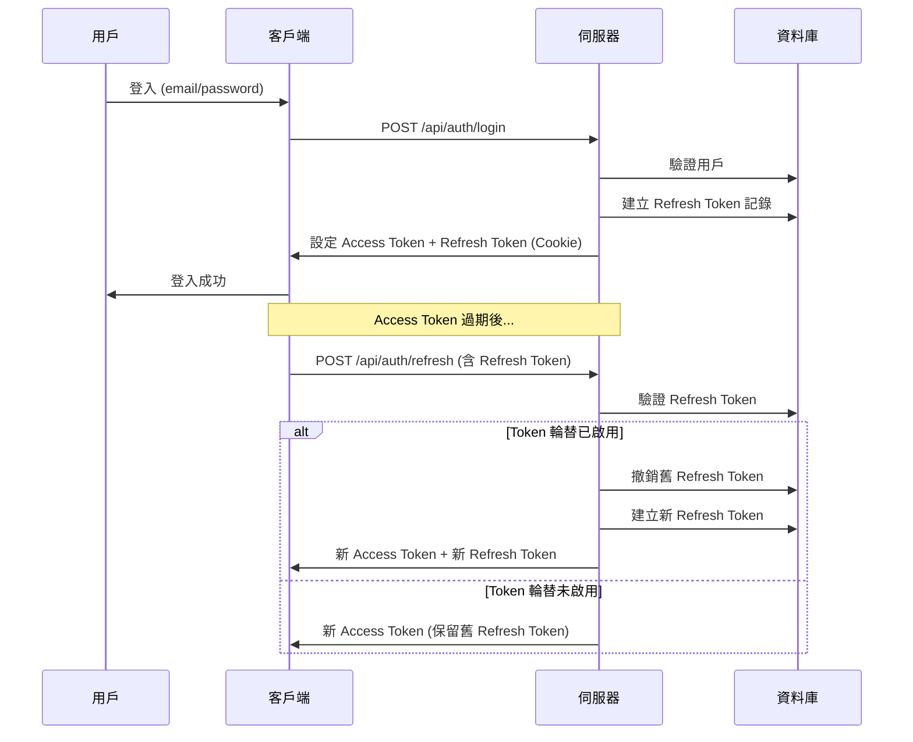

# Token 持久化機制文檔

## 📋 目錄

1. [概述](#概述)
2. [Token 架構](#token-架構)
3. [運作機制](#運作機制)
4. [資料庫設計](#資料庫設計)
5. [實作細節](#實作細節)
6. [安全性設計](#安全性設計)
7. [配置選項](#配置選項)

---

## 概述

本系統採用 **JWT (JSON Web Token)** 雙 Token 機制（Access Token + Refresh Token）實現用戶認證與授權，並透過資料庫持久化 Refresh Token 以支援 Token 撤銷功能。

### 核心特性

- ✅ **雙 Token 機制**：短效 Access Token + 長效 Refresh Token
- ✅ **Token 輪替 (Token Rotation)**：每次刷新時產生新的 Refresh Token（可配置）
- ✅ **Token 撤銷**：支援主動撤銷 Refresh Token
- ✅ **HttpOnly Cookie**：防止 XSS 攻擊
- ✅ **資料庫持久化**：所有 Refresh Token 記錄在資料庫中

---

## Token 架構

### Token 類型

| Token 類型 | 有效期 | 儲存位置 | 用途 |
|-----------|--------|----------|------|
| **Access Token** | 15 分鐘 | HttpOnly Cookie | 驗證 API 請求 |
| **Refresh Token** | 7 天 | HttpOnly Cookie + DB | 刷新 Access Token |

### Token 生命週期



### 前端視角：Token 儲存與處理

> [!IMPORTANT]
> **Refresh Token 儲存在瀏覽器的 HttpOnly Cookie 中，前端 JavaScript 完全無法存取！**

#### Token 儲存位置

| 元件 | Access Token | Refresh Token |
|------|--------------|---------------|
| **儲存位置** | HttpOnly Cookie (`access_token`) | HttpOnly Cookie (`refresh_token`) |
| **前端可見性** | ❌ 不可見（httpOnly） | ❌ 不可見（httpOnly） |
| **自動傳送** | ✅ 自動（瀏覽器處理） | ✅ 自動（瀏覽器處理） |

#### 前端處理流程

```typescript
// ❌ 前端無法這樣做（Cookie 是 HttpOnly）
const refreshToken = document.cookie; // 無法取得

// ✅ 前端只需要呼叫 API，Cookie 會自動附帶
const response = await fetch('/api/auth/me', {
  credentials: 'include', // 自動帶上 Cookie
});
```

#### 關鍵設計原則

1. **前端不需要關心 Token**
   - 登入後，伺服器自動設定 Cookie
   - 每次 API 請求，瀏覽器自動帶上 Cookie
   - Token 過期時，伺服器自動刷新

2. **安全性優先**
   - `httpOnly: true` → JavaScript 無法存取，防止 XSS 攻擊
   - `secure: true` → 只在 HTTPS 傳輸，防止中間人攻擊
   - `sameSite: 'lax'` → 防止 CSRF 攻擊

3. **透明化處理**
   - 前端開發者不需要手動管理 Token
   - 認證邏輯完全在伺服器端
   - 前端只需處理登入/登出 UI 與錯誤處理

#### AuthContext 使用範例

**檔案**: [lib/auth/AuthContext.tsx](./../lib/auth/AuthContext.tsx)

```typescript
// 前端使用 AuthContext，不需要直接處理 Token
const { user, login, logout } = useAuth();

// 登入（Token 由伺服器自動設定為 Cookie）
await login(email, password);

// 登出（Token 由伺服器清除）
await logout();

// API 請求（瀏覽器自動帶上 Cookie）
const response = await fetch('/api/auth/me', {
  credentials: 'include', // 重要：確保 Cookie 被傳送
});
```

### 前後端分離架構考量

> [!WARNING]
> **HttpOnly Cookie 在跨域（Cross-Origin）部署時需要特殊配置，否則無法正常運作！**

#### 本專案架構

本專案使用 **Next.js 全端框架**，前後端部署在同一域名：

```
前端頁面：https://example.com/*
API 路由：https://example.com/api/*
```

✅ **優點**：
- Cookie 可以正常運作（同源政策允許）
- 不需要複雜的 CORS 配置
- 安全性最高（HttpOnly + SameSite）

#### 跨域部署情境

如果您計劃將前後端分離部署到不同域名，需要考慮以下問題：

##### 情境 1: 子域名分離

```
前端：https://app.example.com
後端：https://api.example.com
```

**解決方案**：設定 Cookie Domain

```typescript
// 後端設定 Cookie 時
cookieStore.set('refresh_token', token, {
  httpOnly: true,
  secure: true,
  sameSite: 'none', // ⚠️ 必須改為 none
  domain: '.example.com', // 設定為父域名
  path: '/',
  maxAge: 7 * 24 * 60 * 60,
});
```

**CORS 配置**：

```typescript
// 後端需設定 CORS
res.setHeader('Access-Control-Allow-Origin', 'https://app.example.com');
res.setHeader('Access-Control-Allow-Credentials', 'true');
res.setHeader('Access-Control-Allow-Methods', 'GET, POST, PUT, DELETE');
res.setHeader('Access-Control-Allow-Headers', 'Content-Type');
```

**前端請求**：

```typescript
// 前端必須加上 credentials
fetch('https://api.example.com/api/auth/me', {
  credentials: 'include', // 必須設定
});
```

##### 情境 2: 完全不同域名

```
前端：https://myapp.com
後端：https://myapi.com
```

⚠️ **問題**：
- Chrome/Safari 等瀏覽器逐步禁止第三方 Cookie
- `SameSite=None` 在某些瀏覽器可能失效
- 用戶隱私設定可能阻擋跨域 Cookie

**替代方案**：

| 方案 | 說明 | 優點 | 缺點 |
|------|------|------|------|
| **BFF 模式** | 前端伺服器代理 API 請求 | ✅ Cookie 仍可用<br>✅ 安全性高 | ⚡ 需要額外伺服器 |
| **Bearer Token** | 使用 Authorization Header | ✅ 無跨域問題<br>✅ 行動 App 友善 | 🔓 需要前端儲存（localStorage）<br>🔓 易受 XSS 攻擊 |
| **Session + Redis** | 後端 Session 管理 | ✅ Token 不外洩 | ⚡ 需要 Redis<br>⚡ 水平擴展複雜 |

#### 推薦方案：BFF (Backend for Frontend)

```
用戶瀏覽器 → 前端伺服器 (Next.js) → 後端 API
            ↑ HttpOnly Cookie ↑
```

**架構說明**：
1. 前端伺服器（Next.js）與後端 API 分離
2. 前端伺服器作為中介層，代理所有 API 請求
3. Cookie 在前端伺服器與瀏覽器之間傳遞（同域）
4. 前端伺服器與後端 API 使用 API Key 或內部認證

**優點**：
- ✅ 保留 HttpOnly Cookie 的安全性
- ✅ 前端無需修改（仍使用 Cookie）
- ✅ 後端可獨立擴展

#### Bearer Token 替代方案

如果必須使用完全分離的架構，可改用 Bearer Token：

**登入流程**：
```typescript
// 後端回傳 Token（不設定 Cookie）
return res.json({
  accessToken: 'eyJ...',
  refreshToken: 'eyJ...',
});

// 前端儲存（注意：較不安全）
localStorage.setItem('access_token', accessToken);
localStorage.setItem('refresh_token', refreshToken);
```

**API 請求**：
```typescript
fetch('https://api.example.com/api/auth/me', {
  headers: {
    'Authorization': `Bearer ${localStorage.getItem('access_token')}`,
  },
});
```

> [!CAUTION]
> **安全性降低**：
> - ❌ LocalStorage 可被 JavaScript 存取（XSS 風險）
> - ❌ 需要手動處理 Token 刷新邏輯
> - ❌ Token 可能在開發工具中被看到

#### 總結建議

| 部署方式 | 推薦方案 | 理由 |
|----------|----------|------|
| **同域部署**（Next.js） | HttpOnly Cookie | 最安全、最簡單 |
| **子域名分離** | HttpOnly Cookie + CORS | 仍然安全，需配置 CORS |
| **完全分離** | BFF 模式 | 平衡安全性與靈活性 |
| **行動 App** | Bearer Token | 無 Cookie 機制，必須使用 |

---

## 運作機制


### 1. 登入流程

**檔案**: [app/api/auth/login/route.ts](./../app/api/auth/login/route.ts)

1. 用戶提交 email/password
2. 伺服器驗證憑證
3. 產生 JTI (JWT ID) 作為 Refresh Token 的唯一識別
4. 在資料庫建立 Refresh Token 記錄
5. 產生 Access Token 與 Refresh Token（JWT）
6. 將兩個 Token 設定為 HttpOnly Cookie
7. 回傳用戶資訊

```typescript
// 產生 Refresh Token
const jti = generateJti(); // UUID v4
await RefreshToken.create({
  userId: user.id,
  jti,
  expiresAt: getRefreshTokenExpiryDate(), // 7 天後
});

const refreshToken = createRefreshToken(user.id, jti);
const accessToken = createAccessToken(authUser);

// 設定 Cookie
await setAuthCookies(accessToken, refreshToken);
```

### 2. Token 刷新流程

**檔案**: [app/api/auth/refresh/route.ts](./../app/api/auth/refresh/route.ts)

當 Access Token 過期時，客戶端使用 Refresh Token 取得新的 Access Token：

1. 從 Cookie 取得 Refresh Token
2. 驗證 JWT 簽章與有效期
3. 從資料庫查詢 Token 記錄（使用 JTI）
4. 檢查 Token 是否已撤銷或過期
5. 根據系統設定決定是否進行 **Token 輪替**
   - **啟用輪替**：撤銷舊 Token，建立新 Refresh Token
   - **未啟用**：重用現有 Refresh Token
6. 產生新的 Access Token
7. 更新 Cookie

```typescript
// 驗證 Refresh Token
const storedToken = await RefreshToken.findOne({
  where: { jti: decoded.jti },
});

if (!storedToken || !storedToken.isValid()) {
  return error('Token 已被撤銷或已過期');
}

// Token 輪替（若啟用）
if (tokenRotation) {
  await storedToken.update({ revokedAt: new Date() }); // 撤銷舊 Token
  
  const newJti = generateJti();
  await RefreshToken.create({
    userId: user.id,
    jti: newJti,
    expiresAt: getRefreshTokenExpiryDate(),
  });
  
  const newRefreshToken = createNewRefreshToken(user.id, newJti);
  await setAuthCookies(newAccessToken, newRefreshToken);
}
```

### 3. 登出流程

**檔案**: [app/api/auth/logout/route.ts](./../app/api/auth/logout/route.ts)

1. 從 Cookie 取得 Refresh Token
2. 在資料庫中撤銷該 Token（設定 `revokedAt`）
3. 清除所有 Auth Cookies
4. 回傳成功訊息

```typescript
const refreshTokenCookie = await getRefreshTokenCookie();
if (refreshTokenCookie) {
  const decoded = verifyRefreshToken(refreshTokenCookie);
  if (decoded) {
    await RefreshToken.update(
      { revokedAt: new Date() },
      { where: { jti: decoded.jti } }
    );
  }
}

await clearAuthCookies();
```

### 4. 中介層驗證

**檔案**: [proxy.ts](./../proxy.ts) (Next.js Middleware)

每個請求都會經過中介層檢查：

1. 從 Cookie 讀取 Access Token
2. 解碼 JWT 取得權限資訊（不驗證簽章，僅用於路由判斷）
3. 根據路由與權限決定：
   - 未認證 + 受保護路由 → 重定向到登入頁
   - 已認證 + 登入頁 → 重定向到適當的儀表板
   - 已認證 + 受保護路由 → 允許繼續

```typescript
const accessToken = request.cookies.get('access_token')?.value;

if (isProtectedRoute && !accessToken) {
  return NextResponse.redirect(loginUrl);
}

if (isLoginPage && accessToken) {
  const hasAdminPerms = userPermissions.some(p => ADMIN_PERMISSIONS.includes(p));
  const redirectPath = hasAdminPerms ? `/${locale}/admin` : `/${locale}/pos`;
  return NextResponse.redirect(redirectPath);
}
```

---

## 資料庫設計

### 資料表：`refresh_tokens`

**檔案**: [db/migrations/20260118000000-create-refresh-tokens.ts](./../db/migrations/20260118000000-create-refresh-tokens.ts)

| 欄位 | 類型 | 說明 |
|------|------|------|
| `id` | INT | 主鍵 |
| `user_id` | INT | 外鍵，關聯 `users.id` |
| `jti` | VARCHAR(64) | JWT ID，唯一識別符 |
| `expires_at` | DATETIME | 過期時間 |
| `revoked_at` | DATETIME (nullable) | 撤銷時間 |
| `created_at` | DATETIME | 建立時間 |

**索引**:
- `jti` (UNIQUE) - 快速查詢 Token
- `user_id` - 查詢用戶的所有 Token
- `expires_at` - 清理過期 Token

### Model 方法

**檔案**: [db/models/RefreshToken.ts](./../db/models/RefreshToken.ts)

```typescript
class RefreshToken extends Model {
  // 檢查是否已撤銷
  isRevoked(): boolean {
    return this.revokedAt !== null;
  }

  // 檢查是否已過期
  isExpired(): boolean {
    return new Date() > this.expiresAt;
  }

  // 檢查是否有效（未撤銷且未過期）
  isValid(): boolean {
    return !this.isRevoked() && !this.isExpired();
  }
}
```

---

## 實作細節

### Cookie 配置

**檔案**: [types/auth.ts](./../types/auth.ts)

```typescript
export const ACCESS_TOKEN_COOKIE: TokenCookieConfig = {
  name: 'access_token',
  path: '/',
  maxAge: 15 * 60, // 15 分鐘
};

export const REFRESH_TOKEN_COOKIE: TokenCookieConfig = {
  name: 'refresh_token',
  path: '/',
  maxAge: 7 * 24 * 60 * 60, // 7 天
};
```

**安全屬性**:
- `httpOnly: true` - 防止 JavaScript 存取
- `secure: true` (生產環境) - 只透過 HTTPS 傳輸
- `sameSite: 'lax'` - 防止 CSRF 攻擊

### Cookie 操作工具

**檔案**: [utils/auth/cookies.ts](./../utils/auth/cookies.ts)

```typescript
// 設定 Access Token
export async function setAccessTokenCookie(token: string): Promise<void>;

// 設定 Refresh Token
export async function setRefreshTokenCookie(token: string): Promise<void>;

// 同時設定兩個 Token
export async function setAuthCookies(
  accessToken: string, 
  refreshToken: string
): Promise<void>;

// 取得 Access Token
export async function getAccessTokenCookie(): Promise<string | undefined>;

// 取得 Refresh Token
export async function getRefreshTokenCookie(): Promise<string | undefined>;

// 清除所有 Auth Cookies
export async function clearAuthCookies(): Promise<void>;
```

### JWT 工具

**檔案**: [utils/auth/jwt.ts](./../utils/auth/jwt.ts)

```typescript
// 產生 Access Token
export function createAccessToken(user: AuthUser): string;

// 產生 Refresh Token
export function createRefreshToken(userId: number, jti: string): string;

// 驗證 Access Token
export function verifyAccessToken(token: string): AccessTokenPayload | null;

// 驗證 Refresh Token
export function verifyRefreshToken(token: string): RefreshTokenPayload | null;

// 產生唯一 JTI
export function generateJti(): string; // UUID v4

// 計算 Refresh Token 過期日期
export function getRefreshTokenExpiryDate(): Date; // 現在 + 7 天
```

---

## 安全性設計

### 1. XSS 防護

- **HttpOnly Cookie**: Token 儲存在 HttpOnly Cookie 中，JavaScript 無法存取
- **Content Security Policy**: 限制可執行的腳本來源

### 2. CSRF 防護

- **SameSite Cookie**: 設定為 `lax`，防止跨站請求偽造
- **Referer 驗證**: 中介層可額外驗證請求來源

### 3. Token 安全

- **短效 Access Token**: 15 分鐘後自動失效，減少被盜用風險
- **Token 撤銷**: Refresh Token 可主動撤銷
- **Token 輪替**: 每次刷新產生新 Token，舊 Token 立即失效
- **JTI 唯一性**: 每個 Refresh Token 都有唯一識別符

### 4. HTTPS

- 生產環境強制使用 HTTPS (`secure: true`)
- 防止中間人攻擊竊取 Token

### 5. Token 清理

建議定期清理過期的 Refresh Token：

```sql
DELETE FROM refresh_tokens 
WHERE expires_at < NOW() 
   OR revoked_at IS NOT NULL;
```

---

## 配置選項

### Token 輪替設定

在 `settings` 表中配置：

```sql
INSERT INTO settings (key, value, store_id) 
VALUES ('auth_token_rotation', 'true', NULL);
```

- `'true'` (預設): 啟用 Token 輪替，每次刷新產生新 Refresh Token
- `'false'`: 停用 Token 輪替，重用現有 Refresh Token

**權衡考量**:

| Token 輪替 | 優點 | 缺點 |
|-----------|------|------|
| **啟用** | 🔒 更安全，舊 Token 立即失效 | ⚡ 資料庫寫入較頻繁 |
| **停用** | ⚡ 減少資料庫操作 | 🔓 Refresh Token 有效期內可重複使用 |

### 單一裝置登入設定

```sql
INSERT INTO settings (key, value, store_id) 
VALUES ('auth_single_device_login', 'false', NULL);
```

- `'true'`: 啟用單一裝置登入，登入時撤銷該用戶所有舊 Token
- `'false'` (預設): 允許多裝置同時登入

---

## 相關檔案

### API Routes
- [app/api/auth/login/route.ts](./../app/api/auth/login/route.ts) - 登入 API
- [app/api/auth/logout/route.ts](./../app/api/auth/logout/route.ts) - 登出 API
- [app/api/auth/refresh/route.ts](./../app/api/auth/refresh/route.ts) - Token 刷新 API
- [app/api/auth/me/route.ts](./../app/api/auth/me/route.ts) - 取得當前用戶 API

### 工具函數
- [utils/auth/jwt.ts](./../utils/auth/jwt.ts) - JWT 工具
- [utils/auth/cookies.ts](./../utils/auth/cookies.ts) - Cookie 工具
- [utils/auth/permissions.ts](./../utils/auth/permissions.ts) - 權限工具

### 資料庫
- [db/models/RefreshToken.ts](./../db/models/RefreshToken.ts) - RefreshToken Model
- [db/migrations/20260118000000-create-refresh-tokens.ts](./../db/migrations/20260118000000-create-refresh-tokens.ts) - Migration

### 前端
- [lib/auth/AuthContext.tsx](./../lib/auth/AuthContext.tsx) - React Auth Context
- [proxy.ts](./../proxy.ts) - Next.js Middleware

### 型別定義
- [types/auth.ts](./../types/auth.ts) - 認證相關型別

---

**Last Updated**: 2026-01-23
